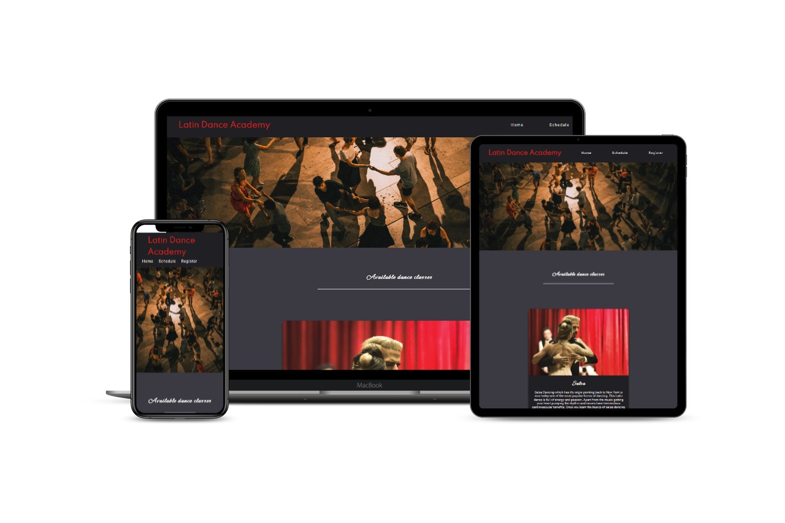
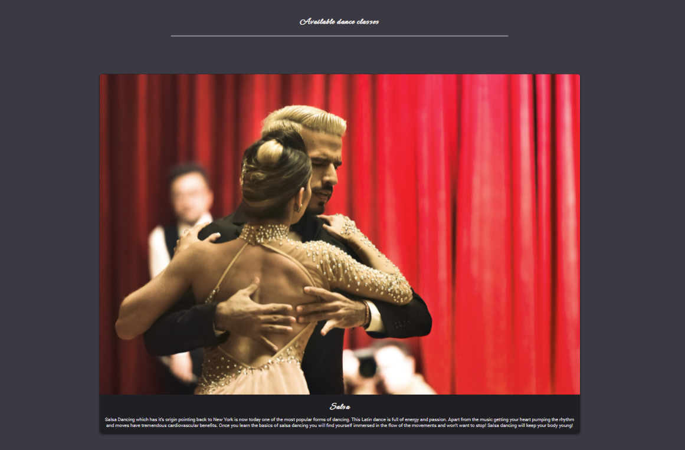
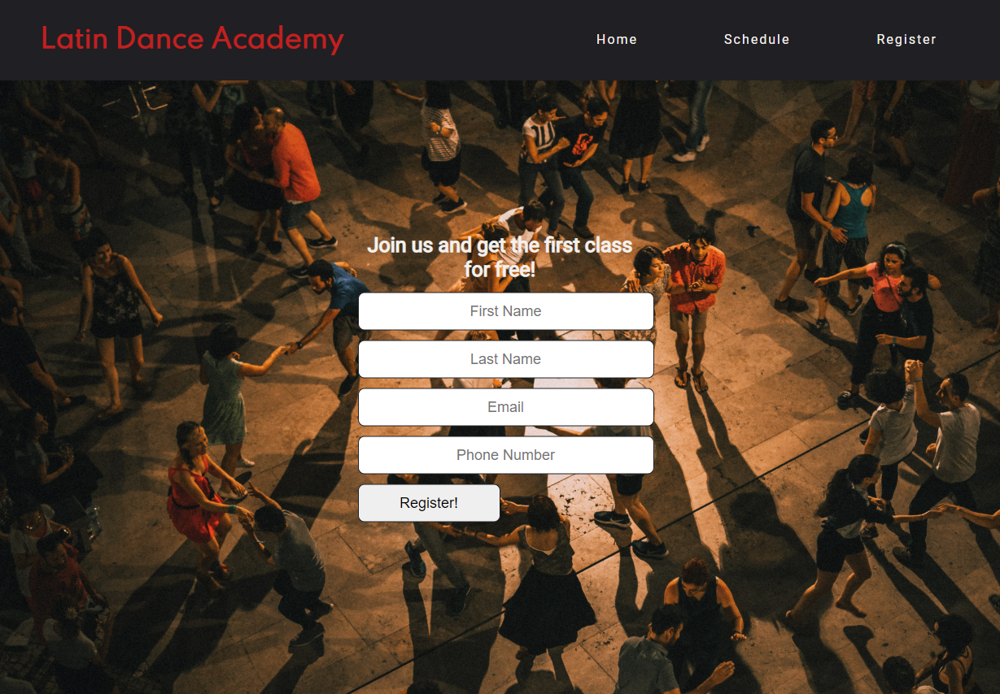

# Latin Dance Academy

Latin Dance Academy is a site for the dance studio in Dublin. Studio is focused on latin dances like salsa, bachata and mambo. Classes are available for the new dancers that are just learing their first dance steps and advanced dancers or professionals.

## Features 

### Existing Features

- __Navigation Bar__

  - Navigation bar is being fetured on all of the pages. This allows everyone who visits the site to navigate between the different parts of the site without going back to the main page.

- __Dance classes section__

  - This section shows available dance classes which the users can sign up for.
  - It show the pictures and description of the dances in the form of the cards.

- __The Footer__ 

  - The footer section includes copy right and links to the social media sites for Latin Dance Academy. 
  - Links will open in a new tab, and they have the highlight effect to show which one is being hovered on.

- __Class Schedule__

  - This part of the site shows the users a table with the class schedule. Top rows are collored to spot the days easily and each cell features the difficulty of the class and time.
  - Users would check their corresponding class schedule here and get updates on it.

- __Registration Form__

  - This page will allow users to register for the class.
  - It's a simple form which shows what kind of info needs to be added in which section and a submit button with the highlight.

### Features Left to Implement

- Idea is to have the dance cards on the main page clickable with the hover effect.
- This would lead the user onto the separate page for each dance with more info, pictures and videos.

- Dropdown menus in the registration form for selections like male or female dancer and current skill level.

## Technologies used

- HTML
- CSS
- Gitpod
- GitHub
- GitHub Pages
- Font Awesome
- Google Fonts

## Testing 

### Validator Testing 

- HTML
  - 1 warning about no heading element in the section [W3C validator](https://validator.w3.org/nu/?showsource=yes&doc=https%3A%2F%2Fgjularic.github.io%2Flatin-dance-academy%2F)
- CSS
  - No errors were found when passing through the official [(Jigsaw) validator](https://jigsaw.w3.org/css-validator/validator?uri=https%3A%2F%2Fgjularic.github.io%2Flatin-dance-academy%2F&profile=css3svg&usermedium=all&warning=1&vextwarning=&lang=en)

## Deployment

The live link can be found here - https://gjularic.github.io/latin-dance-academy/

## Credits 

### Content 

